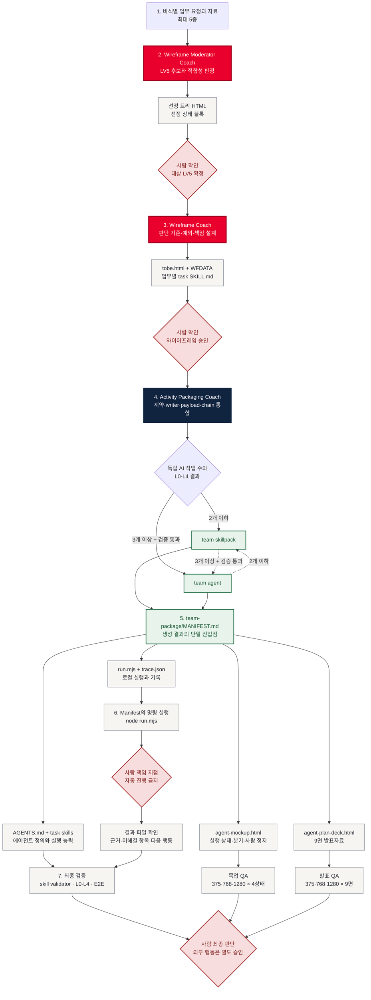

# SKI Skills

SK이노베이션 「1인 1Agent」 과정에서 쓰는 **AI 스킬(Skill) 저장소**입니다.

작업 방식은 [File-based Planning Workflow](https://github.com/ahastudio/til/blob/main/ai/file-based-planning-workflow.md)
([원본 저장소](https://github.com/ahastudio/file-based-planning-workflow))를 그대로 따릅니다.

## 세 코치 전체 사용법

**TL;DR:** 이 저장소는 전체 흐름의 앞단인 **Wireframe Moderator Coach**와 **Wireframe Coach**를 제공합니다. 모더레이터가 적합한 LV5를 고르고, 와이어프레임 코치가 사람의 승인을 받은 `tobe.html`과 업무별 `SKILL.md`를 만듭니다. 실행 가능한 팀 스킬팩·에이전트, 실행 목업, 발표자료 패키징은 [Jcurve_SKI](https://github.com/gbrinan/Jcurve_SKI)의 Activity Packaging Coach로 넘깁니다. 독립 배포용 와이어프레임 코치는 [wireframe-coach](https://github.com/gbrinan/wireframe-coach)에서도 받을 수 있습니다.



빨간 노드가 이 저장소가 직접 제공하는 단계입니다. 사람 확인을 통과하지 않은 참고자료는 현재 업무 사실로 승격하지 않으며, 와이어프레임 승인 전에는 실행 패키징으로 넘어가지 않습니다.

## 구조

```text
.
├── CLAUDE.md              # AI 에이전트 작업 규칙 (워크플로우 정의)
├── templates/             # 문서 템플릿 (복사해서 사용)
│   ├── README.md          # 기능 개요
│   ├── spec.md            # 요구사항 / PRD
│   ├── plan.md            # 기술 구현 계획
│   ├── tasks.md           # 작업 계획 및 추적
│   ├── findings.md        # 기술적 발견 / 결정 / 에러 기록
│   └── progress.md        # 세션별 작업 내역
└── docs/features/         # 기능별 작업 문서 (템플릿 복사본이 쌓이는 곳)
    └── <기능명>/
        ├── README.md
        ├── spec.md
        ├── plan.md
        ├── tasks.md
        ├── findings.md
        └── progress.md
```

## 시작하기

새 기능(또는 새 스킬) 작업을 시작할 때:

```bash
FEATURE=my-feature
mkdir -p docs/features/$FEATURE
cp templates/*.md docs/features/$FEATURE/
```

그다음 `docs/features/$FEATURE/tasks.md`의 Phase 1부터 진행합니다.

## 핵심 원칙

- **문서가 곧 컨텍스트다.** 세션이 끊겨도 6개 문서만 읽으면 이어서 작업할 수 있어야 합니다.
- **갱신 시점을 지킨다.** Phase 시작 시 `tasks.md`, 발견/결정 즉시 `findings.md`, 세션 종료 시 `progress.md`.
- **에러는 반드시 남긴다.** 같은 삽질을 두 번 하지 않기 위해서입니다.
