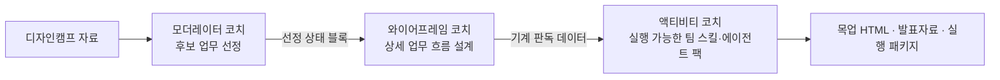

# SKI Skills

SK이노베이션 「1인 1Agent」 과정에서 쓰는 **AI 스킬(Skill) 저장소**입니다.

작업 방식은 [File-based Planning Workflow](https://github.com/ahastudio/til/blob/main/ai/file-based-planning-workflow.md)
([원본 저장소](https://github.com/ahastudio/file-based-planning-workflow))를 그대로 따릅니다.

## 구조

```text
.
├── CLAUDE.md              # AI 에이전트 작업 규칙 (워크플로우 정의)
├── templates/             # 문서 템플릿 (복사해서 사용)
│   ├── README.md          # 기능 개요
│   ├── spec.md            # 요구사항 / PRD
│   ├── plan.md            # 기술 구현 계획
│   ├── tasks.md           # 작업 계획 및 추적
│   ├── findings.md        # 기술적 발견 / 결정 / 에러 기록
│   └── progress.md        # 세션별 작업 내역
└── docs/features/         # 기능별 작업 문서 (템플릿 복사본이 쌓이는 곳)
    └── <기능명>/
        ├── README.md
        ├── spec.md
        ├── plan.md
        ├── tasks.md
        ├── findings.md
        └── progress.md
```

## 시작하기

새 기능(또는 새 스킬) 작업을 시작할 때:

```bash
FEATURE=my-feature
mkdir -p docs/features/$FEATURE
cp templates/*.md docs/features/$FEATURE/
```

그다음 `docs/features/$FEATURE/tasks.md`의 Phase 1부터 진행합니다.

## 세 코치 사용 순서



1. `skills/wireframe-moderator-coach.md`: 전체 지도에서 팀이 다룰 후보 업무를 고릅니다.
2. `skills/wireframe-coach.md`: 고른 업무의 입력·처리·판단·사람 확인 흐름을 설계합니다.
3. Activity Coach는 별도 [Jcurve_SKI](https://github.com/gbrinan/Jcurve_SKI) 저장소의 패키징 스킬을 사용합니다.

### 모더레이터 선정 보드 만들기

v1.4는 결과 읽는 방법 → 전체 업무 지도 → 프로세스(LV4) → 후보 업무(LV5) → 해당 후보의 세부 업무(LV6) → 최종 토의를 한 HTML에서 단계별로 보여줍니다. 사람이 준비하거나 최종 책임지는 업무는 삭제하지 않고 자동화의 시작·정지 경계로 남깁니다.

```bash
node scripts/render-moderator.mjs examples/moderator-ui/strategy-team-data.json examples/moderator-ui/Lv5선정트리_경영전략팀_v1.4.html
node scripts/validate-moderator-output.mjs examples/moderator-ui/Lv5선정트리_경영전략팀_v1.4.html
node scripts/test-moderator-output.mjs
```

- 디자인 계약: `DESIGN.md`
- 재사용 HTML 템플릿: `assets/moderator-selection-tree-template.html`
- 렌더러·validator 공통 입력 계약: `scripts/moderator-schema.mjs`
- 가상 예시: `examples/moderator-ui/`
- 이노허브 배포 정본은 `distribution/innohub/와이어프레임모더레이터코치_v1.4.md` 하나입니다.
- 판정 전 HTML에는 `atf-data`가 없어야 하며, 판정 완료본에만 포함됩니다.
- 화면은 `Pain Point(업무상 불편·병목)`, `Human in the Loop(사람 개입)`처럼 비IT 참가자가 바로 이해할 수 있는 표현을 우선합니다.

## 핵심 원칙

- **문서가 곧 컨텍스트다.** 세션이 끊겨도 6개 문서만 읽으면 이어서 작업할 수 있어야 합니다.
- **갱신 시점을 지킨다.** Phase 시작 시 `tasks.md`, 발견/결정 즉시 `findings.md`, 세션 종료 시 `progress.md`.
- **에러는 반드시 남긴다.** 같은 삽질을 두 번 하지 않기 위해서입니다.
